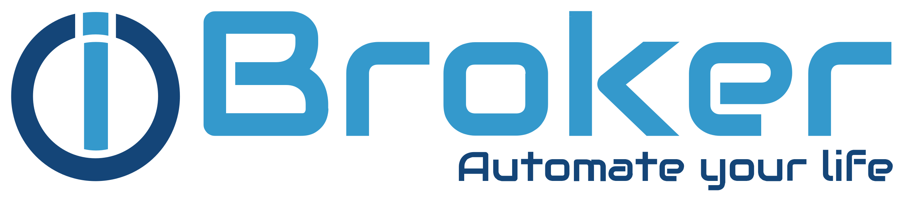

 

[](https://hub.docker.com/repository/docker/buanet/iobroker)
[](https://hub.docker.com/repository/docker/buanet/iobroker)
[](https://hub.docker.com/repository/docker/buanet/iobroker)<br>
[)](https://github.com/buanet/docker.watchdog/actions/workflows/docker_build_main_image.yml)
[](https://github.com/buanet/ioBroker.docker/releases)
[](https://github.com/buanet/ioBroker.docker/issues)<br>
[](https://github.com/buanet/ioBroker.docker)
[](https://github.com/buanet/ioBroker.docker/blob/master/LICENSE.md)

**Note:** New major versions (e.g. v4, v5, v6) of the image always come with a new major verson of node (preinstalled). To avoid issues when upgrading into a new major version the best practice recommendation is to migrate using backup and restore procedure. For more details please see "Best Practices" section on official  [readme.md](https://github.com/buanet/ioBroker.docker#best-practices).

# Quick reference

* Maintained by: [buanet](https://github.com/buanet) and [ioBroker](https://github.com/ioBroker)
* Where to get support: [ioBroker Forum](https://forum.iobroker.net/), [ioBroker Discord Channel](https://discord.gg/HwUCwsH)
* Where to report issues: [Github Repository Issues](https://github.com/buanet/ioBroker.docker/issues)
* Supported architectures: amd64, arm32v7, arm64v8
* Changelog: [Github Repository Changelog](https://github.com/buanet/ioBroker.docker/blob/main/CHANGELOG.md)
* All other questions should be answered here: [Github Repository Readme](https://github.com/buanet/ioBroker.docker#readme) or [iobroker.net](https://www.iobroker.net/)

# Supported tags

* `v5.2.0`, `v5.2.0-amd64`, `v5.2.0-arm32v7`, `v5.2.0-arm64v8`, `latest-v5`, `latest`
* `v5.2.0-node14`, `v5.2.0-node14-amd64`, `v5.2.0-node14-arm32v7`, `v5.2.0-node14-arm64v8`, `latest-v5-node14`, `latest-node14`
* `v5.1.0`, `v5.2.0-amd64`, `v5.2.0-armv7hf`, `v5.2.0-aarch64`

# What is ioBroker?

Text coming soon.

# How to use this image?

## Running from command-line

For taking a first look at iobroker on docker it would be enough to simply run the following basic docker run command:

```
docker run -p 8081:8081 --name iobroker -h iobroker iobroker/iobroker
```

## Running with docker-compose

When using docker-compose define the iobroker service like this:

```
version: '2'

services:
  iobroker:
    container_name: iobroker
    image: iobroker/iobroker
    hostname: iobroker
    restart: always
    ports:
      - "8081:8081"
```

## Persistent data

To make your ioBroker configuration persistent it is recommended to mount a volume or path to `/opt/iobroker`.

On command-line add 
```
-v iobrokerdata:/opt/iobroker
```
On docker-compose add
```
    volumes:
      - iobrokerdata:/opt/iobroker
```

## Configuration via environment variables

You could use environment variables to auto configure your ioBroker container on startup. 

### Configure ioBroker application:

* `IOB_ADMINPORT`(optional, default: 8081) Sets ioBroker adminport on startup
* `IOB_MULTIHOST`(optional) Sets ioBroker "master" or "slave" for multihost support (needs additional config for objectsdb and statesdb!)
* `IOB_OBJECTSDB_HOST` (optional, default: 127.0.0.1) Sets host for ioBroker objects db
* `IOB_OBJECTSDB_PORT` (optional, default: 9001) Sets port for ioBroker objects db
* `IOB_OBJECTSDB_TYPE` (optional, default: file) Sets type of ioBroker objects db, cloud be "file" or "redis" ([not officially supported](https://github.com/ioBroker/ioBroker#databases)).
* `IOB_STATESDB_HOST` (optional, default: 127.0.0.1) Sets host for ioBroker states db
* `IOB_STATESDB_PORT` (optional, default: 9000) Sets port for ioBroker states db
* `IOB_STATESDB_TYPE` (optional, default: file) Sets type of ioBroker states db, could be "file" or "redis"

### Activate special features: 

* `AVAHI` (optional, default: false) Installs and activates avahi-daemon for supporting yahka-adapter, can be "true" or "false"
* `ZWAVE` false|Will install openzwave to support zwave-adapter, can be "true" or "false"|

### Configure environment:

* `LANG` (optional, default: de_DE.UTF&#x2011;8) The following locales are pre-generated: de_DE.UTF-8, en_US.UTF-8
* `LANGUAGE` (optional, default: de_DE:de) The following locales are pre-generated: de_DE:de, en_US:en
* `LC_ALL` (optional, default: de_DE.UTF-8) The following locales are pre-generated: de_DE.UTF-8, en_US.UTF-8
* `PACKAGES` (optional) Installs additional linux packages to your container, packages should be seperated by whitespace like this: "package1 package2 package3".
* `SETGID` (optional, default: 1000) In some cases it might be useful to specify the gid of the containers iobroker user to match an existing group on the docker host
* `SETUID` (optional, default: 1000) In some cases it might be useful to specify the uid of the containers iobroker user to match an existing user on the docker host
* `TZ` (optional, default: Europe/Berlin) Specifys the timeszone
* `USBDEVICES` (optional) Sets relevant permissions on mounted devices like "/dev/ttyACM0". For more than one device separate with ";".

# Support the Project

If you like what you see please leave us stars and likes on our repos and join our growing community.
See you soon. :)
